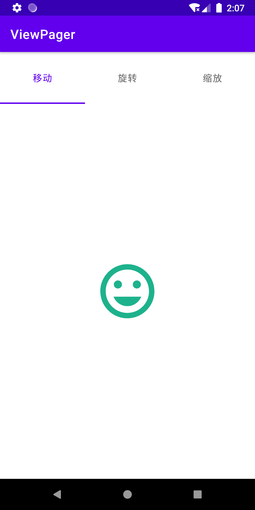

# ViewPager

ViewPager 示例



```groovy
implementation "androidx.viewpager2:viewpager2:1.0.0"
```

```xml
<com.google.android.material.tabs.TabLayout
    android:id="@+id/tablayout"
    android:layout_width="match_parent"
    android:layout_height="80dp">
    // 从左到右排列
    <com.google.android.material.tabs.TabItem
        android:layout_width="wrap_content"
        android:layout_height="wrap_content"
        tools:text="@string/translate" />

    <com.google.android.material.tabs.TabItem
        android:layout_width="wrap_content"
        android:layout_height="wrap_content"
        tools:text="@string/rotate" />

    <com.google.android.material.tabs.TabItem
        android:layout_width="wrap_content"
        android:layout_height="wrap_content"
        tools:text="@string/scale" />
</com.google.android.material.tabs.TabLayout>

<androidx.viewpager2.widget.ViewPager2
    android:id="@+id/viewpager"
    android:layout_width="match_parent"
    android:layout_height="match_parent" />
```

```kotlin
class MainActivity : AppCompatActivity() {
    private lateinit var binding: ActivityMainBinding
    override fun onCreate(savedInstanceState: Bundle?) {
        ...
        viewpager.adapter = object : FragmentStateAdapter(this) {
            override fun getItemCount() = 3

            override fun createFragment(position: Int) =
                when (position) {
                    1 -> FirstFragment.newInstance()
                    2 -> SecondFragment.newInstance()
                    else -> ThirdFragment.newInstance() // position 0
                }
        }
        TabLayoutMediator(tablayout, viewpager) { tab, position ->
            when (position) {
                // 从左到右设置
                0 -> tab.text = resources.getString(R.string.translate)
                1 -> tab.text = getString(R.string.rotate)
                2 -> tab.text = resources.getString(R.string.scale)
            }
        }.attach()
    }
}
```
