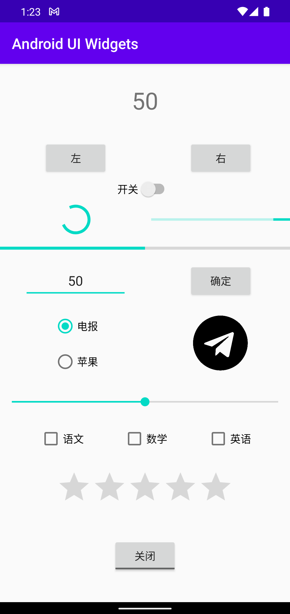

# Android UI 控件

UIWidgetsCollectionActivity 展示常用的基础控件。



## 文本控件

### TextView

用于显示字符串

例如下面 UI 片段定义一个 textSize 为 32sp 的文本。

```xml
<TextView
    android:id="@+id/display"
    android:layout_width="wrap_content"
    android:layout_height="wrap_content"
    android:text="@string/textview"
    android:textSize="32sp" />
```

可以使用 setText 和 getText 设置和获取字符串

```java
display.setText(R.string.on);
display.getText().toString();
```

### EditText

EditText 是 TextView 的子类，提供了编辑功能。

例如下面片段定义了一个具有提示文本（hint）的 EditText
```xml
<EditText
    android:id="@+id/editTextNumber2"
    android:layout_width="0dp"
    android:layout_height="wrap_content"
    android:layout_marginStart="32dp"
    android:layout_marginEnd="32dp"
    android:autofillHints="@string/editText"
    android:ems="10"
    android:hint="@string/editText"
    android:inputType="number"
    android:minHeight="48dp"
    android:textAlignment="center"/>
```

## 按钮控件

### Button

Button 用来和 UI 交互

```xml
<Button
    android:id="@+id/btnLeft"
    android:layout_width="wrap_content"
    android:layout_height="wrap_content"
    android:text="@string/button3" />
```

交互操作通过为 Button 设置 OnClickListener 实现

```java
btnLeft.setOnClickListener(new View.OnClickListener() {
    @Override
    public void onClick(View view) {
        ...
    }
});
```

### ToggleButton Switch CheckBox

ToggleButton Switch CheckBox 都是 CompoundButton 的子类

ToggleButton Switch 是开关控件，CheckBox 可以设置/取消选中态。

```xml
    <ToggleButton
        android:id="@+id/toggleButton"
        android:layout_width="wrap_content"
        android:layout_height="wrap_content"
        android:text="ToggleButton" />

    <CheckBox
        android:id="@+id/checkBox"
        android:layout_width="wrap_content"
        android:layout_height="wrap_content"
        android:minHeight="48dp"
        android:text="@string/checkbox" />

    <Switch
        android:id="@+id/switch"
        android:layout_width="wrap_content"
        android:layout_height="wrap_content"
        android:minHeight="48dp"
        android:text="@string/switch" />
```

这些 Widget 的交互通过设置 OnCheckedChangeListener 实现：

```java
toggleButton.setOnCheckedChangeListener(new CompoundButton.OnCheckedChangeListener() {
    @Override
    public void onCheckedChanged(CompoundButton compoundButton, boolean b) {
        if (b) {
            ...
        } else {
            ...
        }
    }
});
checkBox.setOnCheckedChangeListener(new CheckBox.OnCheckedChangeListener() {
    @Override
    public void onCheckedChanged(CompoundButton compoundButton, boolean b) {
        if (b) {
        ...
        } else {
        ...
        }
    }
});
switch.setOnCheckedChangeListener(new CompoundButton.OnCheckedChangeListener() {
    @Override
    public void onCheckedChanged(CompoundButton compoundButton, boolean b) {
        if (b) {
        ...
        } else {
        ...
        }
    }
});
```

### RadioButton

RadioButton 也是 CompoundButton 的子类，可以单独设置选中态，但是不能单独设置取消态。

因此需要结合 RadioGroup 使用才有意义：

```xml
<RadioGroup
    android:id="@+id/radioGroup"
    android:layout_width="wrap_content"
    android:layout_height="wrap_content">

    <RadioButton
        android:id="@+id/radioButton1"
        android:layout_width="match_parent"
        android:layout_height="wrap_content"
        android:checked="true"
        android:minHeight="48dp"
        android:text="@string/radiobutton1" />

    <RadioButton
        android:id="@+id/radioButton2"
        android:layout_width="match_parent"
        android:layout_height="wrap_content"
        android:minHeight="48dp"
        android:text="@string/radiobutton2" />

</RadioGroup>
```

RadioButton 的交互时通过为 RadioGroup 设置 OnCheckedChangeListener 实现:

```java
radioGroup.setOnCheckedChangeListener(new RadioGroup.OnCheckedChangeListener() {
    @Override
    public void onCheckedChanged(RadioGroup radioGroup, int index) {
        // radioButton1 被选中
        if (index == R.id.radioButton1) {
            ...
        } 
        // 其他 radioButton1 被选中
        else {
            ...
        }
    }
});
```

## 图片

ImageView 用于显示图片，例如下面片段将为 ImageView 设置了初始的图片资源
```xml
    <ImageView
        android:id="@+id/imageView1"
        android:layout_width="0dp"
        android:layout_height="80dp"
        android:contentDescription="@string/imageView"
        app:srcCompat="@drawable/telegramlogo" />
```

setImageResource 可以切换图片资源
```java
imageView.setImageResource(R.drawable.applelogo);
```

## 进度条

### ProgressBar

ProgressBar 有两种样式
- 默认的 Circular ProgressBar
- 水平排布的 Horizontal ProgressBar

ProgressBar 的样式通过 style 属性设置，例如下面代码片段：
```xml
<ProgressBar
    android:id="@+id/circularProgressBar"
    style="?android:attr/progressBarStyle"
    android:layout_width="wrap_content"
    android:layout_height="wrap_content" />

<ProgressBar
    android:id="@+id/horizontalProgressBar"
    style="?android:attr/progressBarStyleHorizontal"
    android:layout_width="0dp"
    android:layout_height="wrap_content" />
```

setProgress 用来为进度条设置进度值:
```java
progressBar.setProgress(50);
```

Circular ProgressBar 默认用来表示加载中，Horizontal ProgressBar 表示加载中状态则需要额外设置 `android:indeterminate` 属性：
```xml
<ProgressBar
    android:id="@+id/indeterminateHorizontalProgressBar"
    style="?android:attr/progressBarStyleHorizontal"
    android:layout_width="0dp"
    android:layout_height="wrap_content"
    android:indeterminate="true" />
```


### SeekBar

SeekBar 是 ProgressBar 的子类，提供了交互控件修改进度值 seek progress。

默认的 SeekBar 设置值的方式是线性的，可以通过 style 属性设置离散的交互样式，例如下面片段：
```xml
    <SeekBar
        android:id="@+id/seekBar3"
        android:layout_width="0dp"
        android:layout_height="wrap_content"/>

    <SeekBar
        android:id="@+id/seekBar"
        style="@style/Widget.AppCompat.SeekBar.Discrete"
        android:layout_width="0dp"
        android:layout_height="wrap_content"
        android:max="10"
        android:progress="3"/>
```

监听 seek progress 的变化通过设置 OnSeekBarChangeListener 实现：
```java
        seekBar.setOnSeekBarChangeListener(new SeekBar.OnSeekBarChangeListener() {
            // 监听 progress 改变
            @Override
            public void onProgressChanged(SeekBar seekBar, int progress, boolean fromUser) {
                ...
            }

            // 监听用户操作
            @Override
            public void onStartTrackingTouch(SeekBar seekBar) {

            }
            @Override
            public void onStopTrackingTouch(SeekBar seekBar) {

            }
        });
```

### RatingBar

RatingBar 是 SeekBar 的子类，提供了交互控件修改等级值 Rating 。

下面片段定义了一个默认的 RatingBar：
```xml
<RatingBar
    android:id="@+id/ratingBar2"
    android:layout_width="wrap_content"
    android:layout_height="wrap_content"
    tools:ignore="SpeakableTextPresentCheck" />
```

监听 rating 的变化通过为 RatingBar 设置 OnRatingBarChangeListener 实现：
```java
ratingBar.setOnRatingBarChangeListener(new RatingBar.OnRatingBarChangeListener() {
    // 监听 rating 变化
    @Override
    public void onRatingChanged(RatingBar ratingBar, float rating, boolean fromUser) {
        Toast.makeText(getApplicationContext(), String.valueOf(rating), Toast.LENGTH_SHORT).show();
    }
});
```
