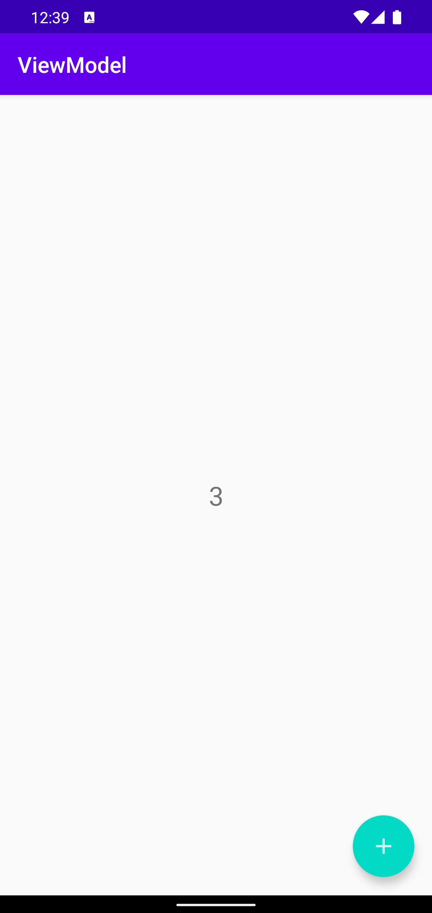

# ViewModel

## ViewModel 概述

ViewModel 库是 Jetpack 架构组件的一部分，是 MVVM 架构模式的核心。

ViewModel 库将 View 相关的数据管理的代码从 UIController 中分离出来，实现了业务逻辑与 UIController 解耦：
- ViewModel 类负责维护数据模型对象。
- 与 UIController 相关的处理则进一步抽象出来交给 Jetpack 框架负责。

使用 ViewModel 库时，需注意 ViewModel 类中不应该包含对所关联 Fragment 或 Activity 等 UI 控制器以及 View 的引用。


下面以实现一个计数器应用为例使用 ViewModel 库。



数据模型类定义如下：

```java
public class MainModel {
    private int number = 0;
    
    // 实现业务
    public void increment() {
        number++;
    }
    
    public int getNumber() {
        return number;
    }
}
```

ViewModel 类则封装了数据模型对象 model，实现了 increment 操作，以及向 UIController 提供 model 对象的读取通道。

```java
import androidx.lifecycle.ViewModel;

public class MainViewModel extends ViewModel {
    private MainModel model;

    public void increment() {
        model.increment();
    }

    public MainModel getModel() {
        if (model == null) {
            model = new MainModel();
        }
        return model;
    }
}
```

UIController 则通过 ViewModelProvider 对象的 get 方法创建 viewModel 对象。

在初始化 UI ，以及需要更新 UI 时，从 ViewModel 获取 model 中维护的数据。

```java
public class MainActivity extends AppCompatActivity {
    FloatingActionButton fab;
    TextView textView;
    MainViewModel viewModel;

    @Override
    protected void onCreate(Bundle savedInstanceState) {
        ...
        viewModel = new ViewModelProvider(this).get(MainViewModel.class);
        textView.setText(String.valueOf(viewModel.getModel().getNumber()));
        fab.setOnClickListener((view) -> {
            viewModel.increment();
            textView.setText(String.valueOf(viewModel.getModel().getNumber()));
        });
    }
}
```

使用了 ViewModel 最显著的好处就是不需要再显式的进行 onSaveInstance 操作，因为 ViewModel 初始化后会一直存在，在屏幕旋转等配置更改期间，UI 控制器会被重建，但 ViewModel 会持续存在，直到 destory UI 控制器。


而在框架层面，和 Activity 生命周期相关的数据缓存被 Jetpack 框架抽象出来，从而实现了业务实现和相关的数据管理与 UIController 解耦。

## ViewModelFactory

ViewModel 之所以能够将业务逻辑 UIController 从中分离出来，关键在于 ViewModelFactory 对象。

ViewModelFactory 的来源有两个途径：
- 使用 UI controller 内置的 ViewModelFactory
- 自定义 ViewModelFactory

UI controller 内置的 ViewModelFactory 在 ViewModelProvider 的默认构造函数中获取，然后再使用获取到的 ViewModelFactory 构建 ViewModelProvider 。
```java
public class ViewModelProvider {
    ...
    public ViewModelProvider(@NonNull ViewModelStoreOwner owner) {
        this(owner.getViewModelStore(), owner instanceof HasDefaultViewModelProviderFactory
                ? ((HasDefaultViewModelProviderFactory) owner).getDefaultViewModelProviderFactory()
                : NewInstanceFactory.getInstance());
    }
    ...
    public ViewModelProvider(@NonNull ViewModelStore store, @NonNull Factory factory) {
        mFactory = factory;
        mViewModelStore = store;
    }
}
```

ViewModelFactory 的作用在于创建 ViewModel 。

在 ViewModelFactory get 成员函数负责根据 ViewModel 的 class 创建 ModelView 对象，然后将 viewModel 缓存 UIController 中，从而将 ViewModel 和 UIController 关联起来。
```java
public <T extends ViewModel> T get(@NonNull String key, @NonNull Class<T> modelClass) {
    // 从缓存中获取 ViewModel
	ViewModel viewModel = mViewModelStore.get(key);

	if (modelClass.isInstance(viewModel)) {
		...
		return (T) viewModel;
	}
	...
	
	if (mFactory instanceof KeyedFactory) {
		viewModel = ((KeyedFactory) (mFactory)).create(key, modelClass);
	} else {
		viewModel = (mFactory).create(modelClass);
	}
	// 缓存 ViewModel
	mViewModelStore.put(key, viewModel);
	return (T) viewModel;
}
```

ViewModel 的创建由实现 ViewModelFactory.Factory 接口的对象负责。

所有 ViewModelFactory 都需要实现 create 抽象方法： 
```java
public interface Factory {
    /**
     * Creates a new instance of the given {@code Class}.
     * <p>
     *
     * @param modelClass a {@code Class} whose instance is requested
     * @param <T>        The type parameter for the ViewModel.
     * @return a newly created ViewModel
     */
    @NonNull
    <T extends ViewModel> T create(@NonNull Class<T> modelClass);
}
```

以自定义 MainViewModelFactory 为例，这里的 modelClass 用于做类型检查，modelClass 不匹配，则不创建 MainViewModel 对象。

```java
public class MainViewModelFactory implements ViewModelProvider.Factory {
    @NonNull
    @Override
    public <T extends ViewModel> T create(@NonNull Class<T> modelClass) {
        if (modelClass.isAssignableFrom(MainViewModel.class)) {
            return (T) new MainViewModel();
        }
        throw new IllegalArgumentException("Unknow ViewModel class");
    }
}
```

在 UIController 中，则在实例化 ViewModelProvider 时将 MainViewModelFactory 实例传参给 ViewModelProvider 构造函数。

然后就可以通过 get 成员函数获取 ViewModel 对象。

```java
public class MainActivity extends AppCompatActivity {
    FloatingActionButton fab;
    TextView textView;
    MainViewModel viewModel;

    @Override
    protected void onCreate(Bundle savedInstanceState) {
        ...
        ViewModelProvider.Factory factory = new MainViewModelFactory();
        viewModel = new ViewModelProvider(this, factory).get(MainViewModel.class);
        textView.setText(String.valueOf(viewModel.getNumber()));
        fab.setOnClickListener((view) -> {
            viewModel.increment();
            textView.setText(String.valueOf(viewModel.getNumber()));
        });
    }
}
```

