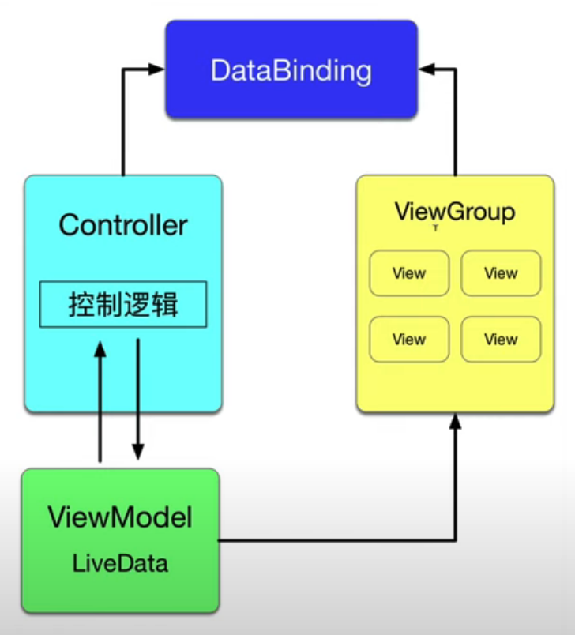
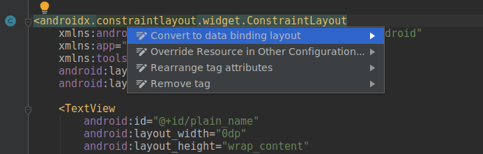

# DataBinding

DataBinding 可以将 ViewModel 以声明方式绑定到界面元素。

使用 DataBinding ，可以使 UIController 与 View 之间不需要显式建立引用的关系，而是由 DataBinding 库根据 Layout 中的配置自动生成代码来建立引用关系。



DataBinding 将 UI 更新逻辑从 UIController 中抽离出来，将 UIController 的代码进一步精简，以及将 View 更新的代码从 ViewController 中独立出来。

DataBinding 的引入是的程序设计更加结构化、模块化，使代码更加容易维护。

## 使用 DataBinding

下面使用 DataBinding 改造计数器应用。

首先在 app 模块的 build.gradle 中，开启 dataBinding ，然后重新 build 项目。

```groovy        
dataBinding {
    enabled true
}
```

上述操作会引入 DataBinding 库。

> DataBinding 库是一个支持库，可以在运行 Android 4.0（API 级别 14）或更高级别的设备上使用。

接着将 layout 转换为支持 DataBinding 的 layout 。

Android Studio 提供了一个方便的自动实现方法: 右键单击根元素，选择 Show Context Actions，然后选 Convert to data binding layout:


DataBinding layout 应该是这样的：

```xml
<layout xmlns:android="http://schemas.android.com/apk/res/android"
xmlns:app="http://schemas.android.com/apk/res-auto"
xmlns:tools="http://schemas.android.com/tools">
    <data>

   </data>
    
    <androidx.constraintlayout.widget.ConstraintLayout
        android:layout_width="match_parent"
        android:layout_height="match_parent"
        tools:context=".MainActivity">

       <TextView
...
```

然后 build 项目，DataBinding 库根据这个 Layout 自动生了 DataBinding 类，例如

```
com.codingnight.android.databinding.databinding.ActivityMainBinding;
```

接着使用 binding 表达式为 DataBinding layout 定义 ViewModel ，并绑定 LiveData 和 UI 交互代码：

```xml
<?xml version="1.0" encoding="utf-8"?>
<layout xmlns:android="http://schemas.android.com/apk/res/android"
    xmlns:app="http://schemas.android.com/apk/res-auto"
    xmlns:tools="http://schemas.android.com/tools">

    <data>
        <variable
            name = "data"
            type="com.codingnight.android.databinding.MainViewModel"/>
    </data>

    <androidx.constraintlayout.widget.ConstraintLayout
        android:layout_width="match_parent"
        android:layout_height="match_parent"
        tools:context=".MainActivity">

        <TextView
            ...
            android:text="@{String.valueOf(data.liveData.number)}"
            ... />

        ...

        <com.google.android.material.floatingactionbutton.FloatingActionButton
            ...
            android:onClick="@{()->data.toggleIncrement()}"
            ... />

            ...

    </androidx.constraintlayout.widget.ConstraintLayout>
</layout>
```
> 注意，需要在 binding 表达式中直接使用 LiveData 对象才能让 DataBinding 框架自动为 LiveData 设置 Observer ，像这样的方式
```xml
android:text="@{String.valueOf(data.getNumber())}"
```
> 是无法自动设置 Observer 的。

再 build 项目，然后在 Acitivity 中使用 DataBinding 类：
- 使用 `DataBindingUtil.setContentView(this, R.layout.activity_main)` 替代 setContentView() 填充 UI，并返回一个 DataBinding 实例。
- 为 DataBinding 实例设置 viewModel 
- 为 DataBinding 实例设置 LifecycleOwner ，让 DataBinding 库为 viewModel 设置 Observer 。
```java
import com.codingnight.android.databinding.databinding.ActivityMainBinding;

public class MainActivity extends AppCompatActivity {

    MainViewModel viewModel;
    ActivityMainBinding binding;

    @Override
    protected void onCreate(Bundle savedInstanceState) {
        super.onCreate(savedInstanceState);
        binding = DataBindingUtil.setContentView(this, R.layout.activity_main);

        ViewModelProvider.Factory factory = new MainViewModelFactory();
        viewModel = new ViewModelProvider(this, factory).get(MainViewModel.class);
        binding.setData(viewModel);
        binding.setLifecycleOwner(this);
    }
}
```

到这里，完成了使用 DataBinding 对计数器应用的改造。

改造效果显而易见：
- 不需要在 UIController 中为 ViewModel 显式设置 Observer 更新 UI 。
- setOnClickListener 等 UI 交互相关代码也被移除，UIController 代码被进一步精简。