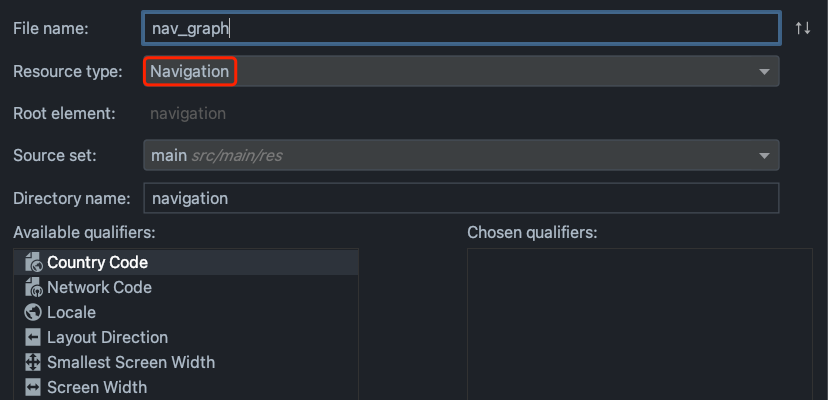
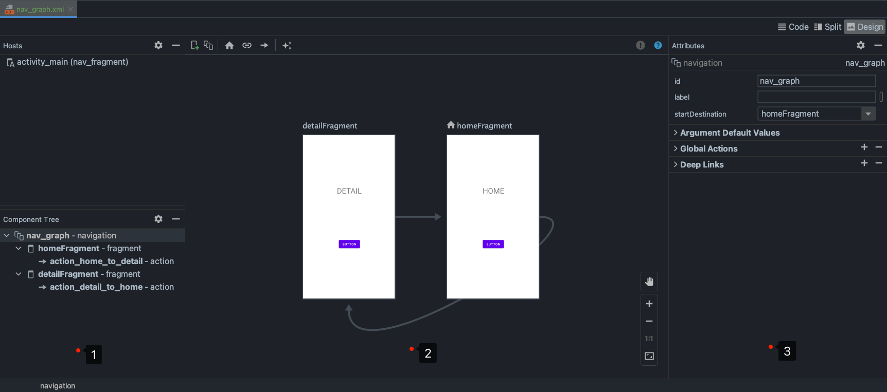
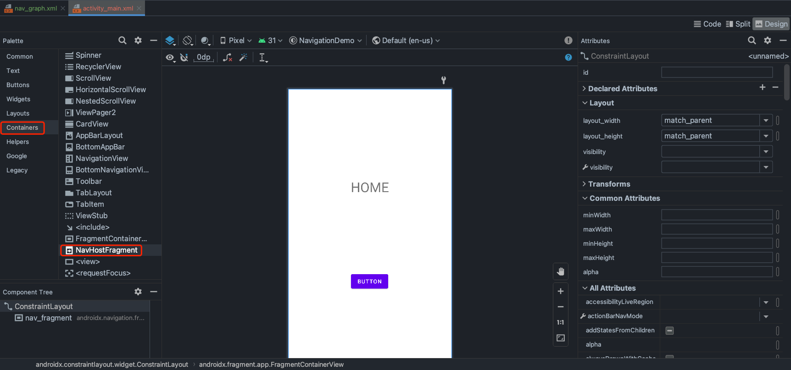
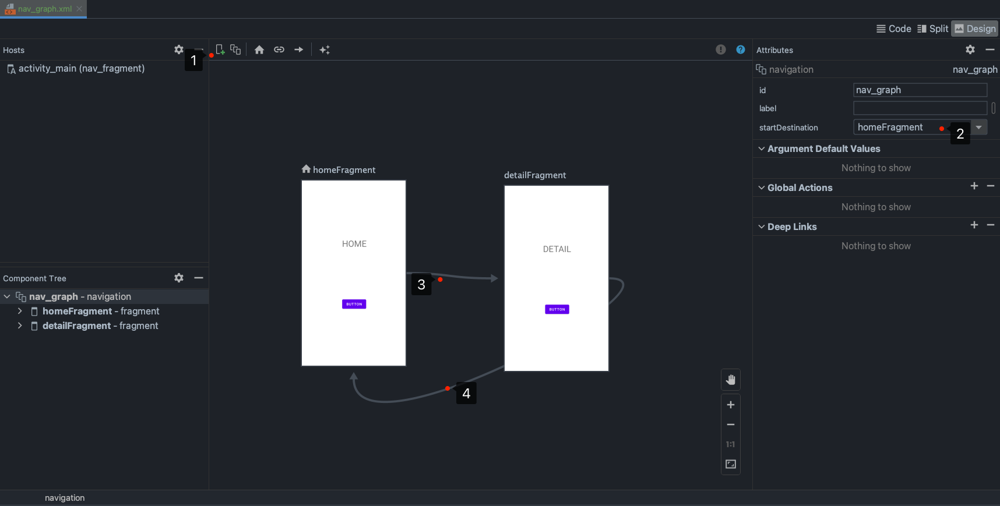

# Navigation

## 设置依赖

```groovy
    implementation 'androidx.navigation:navigation-fragment-ktx:2.3.5'
    implementation 'androidx.navigation:navigation-ui-ktx:2.3.5'
```

## 创建 nav graph 资源文件



## nav graph 编辑器



1. Components panel：列出了导航宿主和目前位于 Graph Editor 中的所有目的地。
2. Graph Editor：包含导航图的视觉表示形式。您可以在 Design 视图和 Text 视图中的底层 XML 表示形式之间切换。
3. Attributes：显示导航图中当前所选项的属性。

## 通过 XML 添加 NavHostFragment



```xml
<?xml version="1.0" encoding="utf-8"?>
<androidx.constraintlayout.widget.ConstraintLayout xmlns:android="http://schemas.android.com/apk/res/android"
    xmlns:app="http://schemas.android.com/apk/res-auto"
    xmlns:tools="http://schemas.android.com/tools"
    android:layout_width="match_parent"
    android:layout_height="match_parent"
    tools:context=".MainActivity">

    <androidx.fragment.app.FragmentContainerView
        android:id="@+id/nav_fragment"
        android:name="androidx.navigation.fragment.NavHostFragment"
        ...
        app:defaultNavHost="true"
        app:navGraph="@navigation/nav_graph" />
</androidx.constraintlayout.widget.ConstraintLayout>
```

## 设置导航路径



如上图所示：
1. 添加 Fragment
2. 设置 startDestination 属性，指定路径的开始 Fragment
3. 添加导航路径
4. 添加返回路径

然后就可以在 Fragment 中使用导航路径进行跳转。

```kotlin
class HomeFragment : Fragment() {
    ...
    override fun onViewCreated(view: View, savedInstanceState: Bundle?) {
        super.onViewCreated(view, savedInstanceState)
        getView()?.findViewById<View>(R.id.button)?.setOnClickListener {
            val controller = Navigation.findNavController(it)
            controller.navigate(R.id.action_home_to_detail)
        }
    }
}
```

```kotlin
class DetailFragment : Fragment() {
    ...
    override fun onViewCreated(view: View, savedInstanceState: Bundle?) {
        super.onViewCreated(view, savedInstanceState)
        getView()?.findViewById<View>(R.id.button2)?.setOnClickListener {
            var navigation = Navigation.findNavController(it)
            navigation.navigate(R.id.action_detail_to_home)
        }
    }
}
```

## Activity 中获取 NavController

### 官方推荐方式

Android 官方建议在 Activity 的 onCreate 中直接从 NavHostFragment 获取 NavController 。

```kotlin
class MainActivity : AppCompatActivity() {
    override fun onCreate(savedInstanceState: Bundle?) {
        super.onCreate(savedInstanceState)
        setContentView(R.layout.activity_main)
        val navHostFragment =
            supportFragmentManager.findFragmentById(R.id.nav_fragment) as NavHostFragment
        val navController = navHostFragment.navController
        ...
    }
}
```

### 使用 Navigation.findNavController

默认只能在 onStart 中通过 Navigation.findNavController 获取 NavController 。

```kotlin
class MainActivity : AppCompatActivity() {
    override fun onStart() {
        super.onStart()
        val controller = Navigation.findNavController(this, R.id.nav_fragment)
        NavigationUI.setupActionBarWithNavController(this, controller)
    }
}
```

Activity 默认是无法在 onCreate 时通过 Navigation.findNavController 获取 NavController ，因为 NavController 是在 onStart 才开始设置。

```java
    @Override
    protected void onStart() {
        ...
        if (!mCreated) {
            mCreated = true;
            mFragments.dispatchActivityCreated();
        }
        ...
    }
```

如果需要在 onCreate 中通过 Navigation.findNavController 获取 NavController ，前提条件是调用 `mFragments.dispatchActivityCreated()`

mFragments 这个成员变量声明在 FragmentActivity 中，而且权限是默认的，无法在 MainActivity 中直接调用，只能通过反射：

```kotlin
class MainActivity : AppCompatActivity() {
    override fun onCreate(savedInstanceState: Bundle?) {
        super.onCreate(savedInstanceState)
        setContentView(R.layout.activity_main)
        initNavController()
        val controller = Navigation.findNavController(this, R.id.nav_fragment)
        NavigationUI.setupActionBarWithNavController(this, controller)
    }
    
    private fun initNavController() {
        //获取 mFragments 成员变量
        val mFragmentsField = FragmentActivity::class.java.getDeclaredField("mFragments").apply {
            isAccessible = true
        }
        //获取 mCreated 成员变量
        val mCreatedField = FragmentActivity::class.java.getDeclaredField("mCreated").apply {
            isAccessible = true
        }
        //获取 dispatchActivityCreated 方法
        val dispatchActivityCreatedMethod =
            FragmentController::class.java.getDeclaredMethod("dispatchActivityCreated").apply {
                isAccessible = true
            }
        //调用 dispatchActivityCreated 方法
        dispatchActivityCreatedMethod.invoke(mFragmentsField.get(this))

        //别忘了把 mCreated 设置为true，防止 dispatchActivityCreated 在 onStart 中再次调用
        mCreatedField.set(this, true)
    }
}
```

> 参考：[Android Navigation 报错 does not have a NavController set on xxxxx 解决方案](https://blog.csdn.net/linminghuo/article/details/119000601)

## 设置 ActionBar

以下代码为 ActionBar 添加导航支持

```kotlin
class MainActivity : AppCompatActivity() {
    override fun onCreate(savedInstanceState: Bundle?) {
        ...
        NavigationUI.setupActionBarWithNavController(this, navController)
    }

    override fun onSupportNavigateUp(): Boolean {
        val controller = Navigation.findNavController(this, R.id.nav_fragment)
        return controller.navigateUp()
    }
}
```

另外，还需要在 nav graph 中为 fragment 设置 label 字符串作为 ActionBar 的标题。

```xml
<?xml version="1.0" encoding="utf-8"?>
<navigation xmlns:android="http://schemas.android.com/apk/res/android"
    ...>

    <fragment
        ...
        android:label="@string/detail"/>
    <fragment
        ...
        android:label="@string/home" />
</navigation>
```