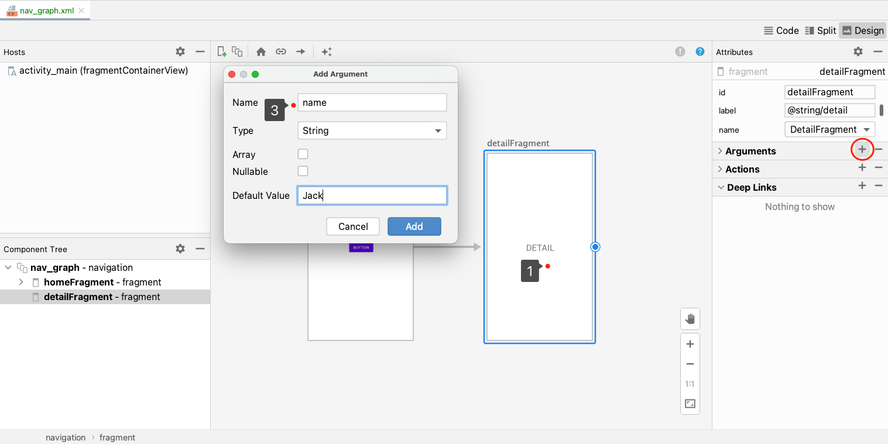
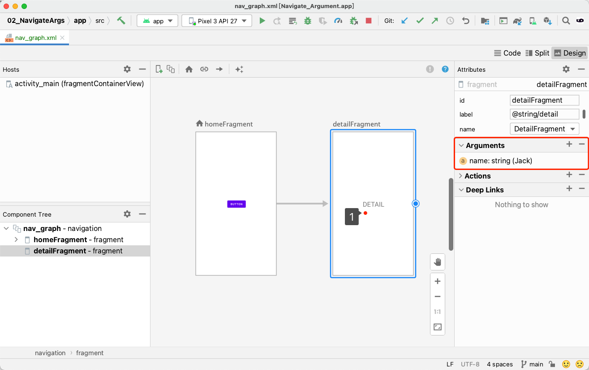
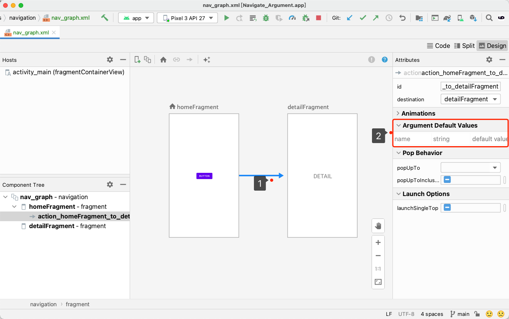

# 导航参数

## 设置默认参数



查看参数设置





## 获取参数

```kotlin
class HomeFragment : Fragment() {

    override fun onViewCreated(view: View, savedInstanceState: Bundle?) {
        super.onViewCreated(view, savedInstanceState)

        requireView().findViewById<View>(R.id.button).setOnClickListener {
            Navigation.findNavController(it).navigate(R.id.action_homeFragment_to_detailFragment)
        }
    }
}
```

```kotlin
const val NAME_PARAM = "name"

class DetailFragment : Fragment() {
    private var name: String? = null

    override fun onCreate(savedInstanceState: Bundle?) {
        super.onCreate(savedInstanceState)
        arguments?.let {
            name = it.getString(NAME_PARAM)
        }
    }

    override fun onViewCreated(view: View, savedInstanceState: Bundle?) {
        super.onViewCreated(view, savedInstanceState)
        requireView().findViewById<TextView>(R.id.name).text = name
    }
}
```

## 动态传参

```kotlin
class HomeFragment : Fragment() {

    override fun onViewCreated(view: View, savedInstanceState: Bundle?) {
        super.onViewCreated(view, savedInstanceState)

        requireView().findViewById<View>(R.id.button).setOnClickListener {
            val str = requireView().findViewById<EditText>(R.id.editText).text.toString();
            if (!TextUtils.isEmpty(str)) {
                val bundle = Bundle()
                bundle.putString(NAME_PARAM, str)
                Navigation.findNavController(it).navigate(R.id.action_homeFragment_to_detailFragment, bundle)
                return@setOnClickListener
            }
            Navigation.findNavController(it).navigate(R.id.action_homeFragment_to_detailFragment)
        }
    }
}
```