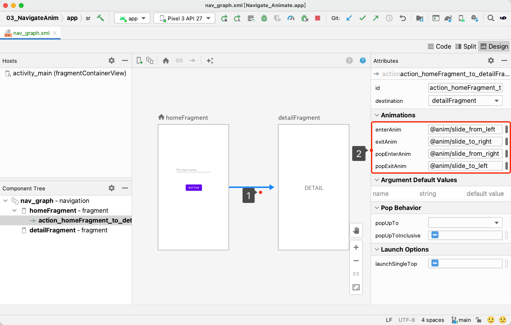
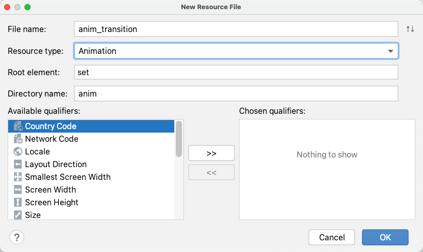

# 导航动画

## 在路径中设置转场动画



转场动画包括进场动画和 pop 动画两部分
- enterAnim 和 exitAnim 组成进场动画
- popEnterAnim 和 popExitAnim 组成 pop 动画
- enterAnim 是应用在压到栈顶的 Fragment 的动画
- popEnterAnim 是应用在 pop 后位于栈顶的 Fragment 的动画
- exitAnim 是应用在被覆盖的的 Fragment 的动画
- popExitAnim 是应用在被 pop 出栈的 Fragment 的动画

## 自定义转场动画

使用 tween animation 实现转场动画。
> tween animation 通过定义关键帧实现动画，支持以下动画类型：
> - translate 平移动画
> - rotate 旋转动画
> - scale 缩放动画
> - alpha 透明度渐变

Android Studio 通过以下步骤自定义 tween animation
1. 创建动画资源文件


2. 定义动画

对于 translate 动画，通常定义 x 和 y 轴位置关键帧，如下定义 x 轴上的起点偏移量和终点偏移量：
```xml
<set xmlns:android="http://schemas.android.com/apk/res/android">
    <translate
        android:fromXDelta="-100%"
        android:toXDelta="0"
        android:duration="300"/>
</set>
```

也可以将多个动画组合起来，例如：
```xml
<set xmlns:android="http://schemas.android.com/apk/res/android">
    <scale
            android:duration="300"
            android:fromXScale="0.0"
            android:fromYScale="0.0"
            android:pivotX="50%"
            android:pivotY="50%"
            android:toXScale="1.0"
            android:toYScale="1.0" />
    <rotate
            android:duration="300"
            android:fromDegrees="0"
            android:pivotX="50%"
            android:pivotY="50%"
            android:toDegrees="360" />
    <alpha
            android:duration="1000"
            android:fromAlpha="0"
            android:toAlpha="1" />
</set>
```

