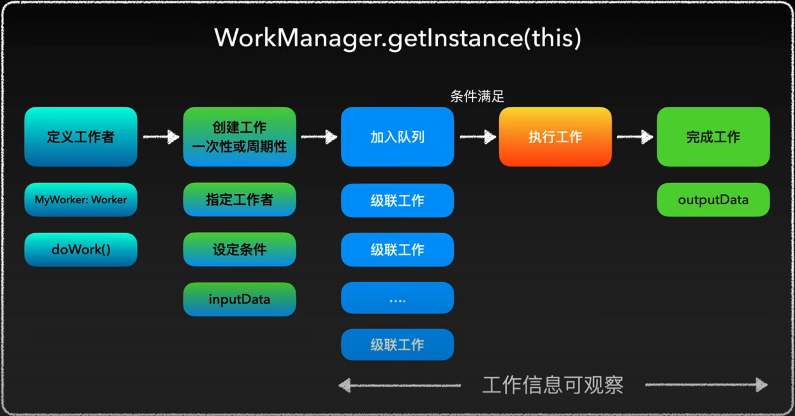

# WorkManager 概述

WorkManager 用来管理调度后台工作
- 支持在任何时候调度异步任务，即使应用退出或设备重启
- 提供统一的方案解决大多数后台问题

WorkManager 库对外一同以下接口：
- Worker：执行异步任务
- WorkRequest：用来描述一个异步任务
- WorkManager: 管理工作

WorkManager 架构


## 使用 WorkManager 执行异步任务

定义 Worker
```kotlin
class MyWorker(context: Context, workerParams: WorkerParameters) : Worker(context, workerParams) {
    override fun doWork(): Result {
        Log.i("MyWork", "doWork: started")
        Thread.sleep(6000)
        Log.i("MyWork", "doWork: finished")
        return Result.success()
    }
}
```

获取 WorkManager 实例，然后使用 WorkRequest.Builder 构建 WorkRequest，最后将 workRequest enqueue 到 WorkManager。
```kotlin
    val workManager = WorkManager.getInstance(this)
    val workRequest = OneTimeWorkRequestBuilder<MyWorker>()
        .build()
    workManager.enqueue(workRequest)
```

## Work 的调度

enqueue() 方法会将 WorkRequest 提交到 WorkManager 的调度队列后，WorkManager 将会在后台调度这个 WorkRequest ，即使应用退出或设备重启，WorkManager 会在应用重新运行后调度这个 WorkRequest。

另外，与一个 WorkRequest 在执行过程中遇到应用退出或设备重启，WorkManager 也会在应用重新运行后调度这个 WorkRequest。